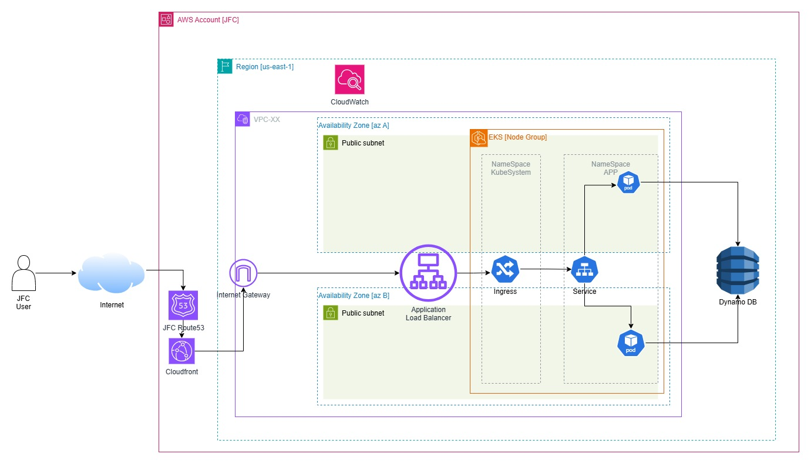

# 🚀  Infraestructura Escalable y Alta Disponibilidad con Terraform en AWS 

Este repositorio contiene la infraestructura como código (IaC) implementada en **Terraform** para desplegar una aplicación JFC. El entorno está diseñado para ser **escalable**, **altamente disponible** y **coste-efectivo**, usando servicios administrados como **EKS**, **ALB**, **DynamoDB**, **CloudWatch**, entre otros.

## 📚 Documentación

Consulta la documentación oficial de [Terraform](https://www.terraform.io/) para obtener más información sobre cómo utilizar esta herramienta con **AWS**.

###  Arquitectura JFC

---

## ✅ Pre-requisitos

- Tener una cuenta en [AWS](https://aws.amazon.com/)
- Tener instalado:
  - [Terraform](https://developer.hashicorp.com/terraform/downloads)
  - [AWS CLI](https://docs.aws.amazon.com/cli/latest/userguide/install-cliv2.html)
- Configurar credenciales AWS (ver más abajo)


---
## 📦 Servicios incluidos

- VPC y Subnets públicas
- EKS (Amazon Elastic Kubernetes Service) con autoescalado
- ALB (Application Load Balancer)
- DynamoDB (base de datos serverless NoSQL)
- CloudWatch (logs y métricas)
- Seguridad con Grupos de Seguridad personalizados
- Infraestructura modularizada con Terraform
- Despliegue CI/CD con GitHub Actions
---
## 🚀 Uso del código
---

## 🔐 Crear Usuario Administrador en AWS

Para obtener credenciales de acceso:

1. Inicia sesión en tu [Consola de AWS](https://console.aws.amazon.com/).
2. Ve a **IAM > Users > Add users**
3. Nombre del usuario: `terraform-admin`
4. Tipo de acceso: marca **Access key - Programmatic access**
5. Asigna el permiso **AdministratorAccess**
6. Completa y guarda el **Access Key ID** y **Secret Access Key**

Luego, configúralos localmente con:

```bash
aws configure
```

---

###  Inicializar el entorno de trabajo

Ejecuta el siguiente comando para inicializar el directorio de trabajo:

```bash
terraform init
```

---

###  Validar los cambios

Antes de aplicar la configuración, puedes previsualizar los cambios con:

```bash
terraform plan
```

---

###  Aplicar los cambios

Para crear la infraestructura:

```bash
terraform apply
```

---

###  Verificar en la consola de AWS

Después de aplicar la configuración, en la consola AWS deberías ver:

* los servicios desplegados


---

###  Eliminar los recursos

Para destruir los recursos creados cuando ya no los necesites:

```bash
terraform destroy
```

